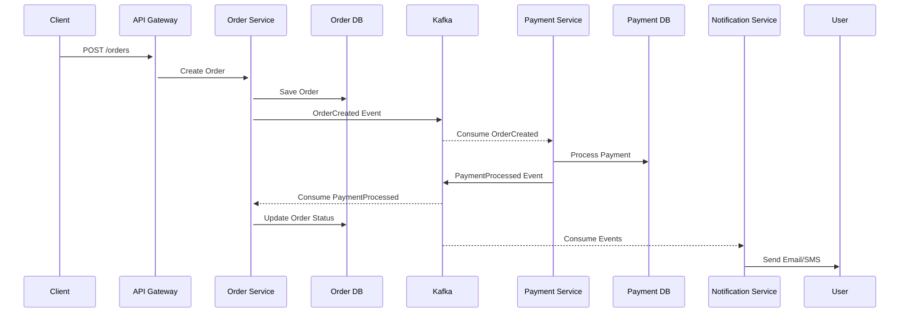

# 🏗️ Event-Driven Microservices Platform with Kafka

A production-ready microservices platform that demonstrates event-driven architecture, resilience engineering, observability, and operations maturity.

This repository implements an e-commerce style workflow with Order, Payment, and Notification services communicating asynchronously through Kafka, fronted by an API Gateway and backed by service discovery.

## ✨ Highlights

- Event-driven communication with Kafka topics across core business services
- Saga-style distributed workflow for order-payment-notification lifecycle
- Database-per-service pattern with isolated PostgreSQL instances
- Resilience patterns with circuit breakers, retries, bulkheads, and fallbacks
- End-to-end observability using Prometheus, Grafana, Loki/Promtail, and tracing
- Production readiness assets including load tests, DR automation, CI/CD, and Kubernetes manifests

## 🧱 Architecture

Core platform components:

- API Gateway (`:8080`)
- Service Registry (Eureka peers at `:8761` and `:8762`)
- Order Service (`:8081`)
- Payment Service (`:8082`)
- Notification Service (`:8083`)
- Kafka cluster (`kafka-1`, `kafka-2`) + Kafka UI (`:8085`)
- Redis cache (`:6379`)
- PostgreSQL per service (`:5433`, `:5434`, `:5435`)

Infrastructure and deployment assets:

- Docker Compose stack: `docker-compose.yml`
- Monitoring stack: `docker-compose.monitoring.yml`
- Kubernetes baseline: `k8s/production/platform.yaml`
- CI/CD workflow: `.github/workflows/ci-cd.yml`

## 🛠️ Technology Stack

### Backend

- Java 21
- Spring Boot 3.x
- Spring Cloud (Gateway + Eureka)
- Apache Kafka
- PostgreSQL (database per service)
- Redis (caching and distributed rate limiting)

### DevOps & Infrastructure

- Docker and Docker Compose
- Kubernetes manifests
- GitHub Actions CI/CD

### Monitoring & Observability

- Prometheus
- Grafana
- Jaeger (Zipkin-compatible tracing endpoint enabled)
- Loki + Promtail
- Alertmanager

### Testing Tools

- JUnit 5
- Testcontainers
- Pact (consumer contracts)
- k6 (performance/load testing)
- Spring Boot integration and repository tests

## 🚀 Quick Start

```bash
# clone repository
git clone https://github.com/MedinDev/Microservices_architecture.git
cd Microservices_architecture

# start platform infrastructure + services
docker compose up -d --build

# start monitoring stack (Prometheus, Grafana, Jaeger, Loki)
docker compose -f docker-compose.monitoring.yml up -d

# verify gateway health
curl http://localhost:8080/actuator/health

# open UIs
open http://localhost:3000    # Grafana
open http://localhost:16686   # Jaeger
open http://localhost:8085    # Kafka UI
```

Build and run services locally without Docker:

```bash
mvn clean package
java -jar services/service-registry/target/service-registry-1.0.0-SNAPSHOT.jar
java -jar services/order-service/target/order-service-1.0.0-SNAPSHOT.jar
java -jar services/payment-service/target/payment-service-1.0.0-SNAPSHOT.jar
java -jar services/notification-service/target/notification-service-1.0.0-SNAPSHOT.jar
java -jar services/api-gateway/target/api-gateway-1.0.0-SNAPSHOT.jar
```

## 🔍 Useful Endpoints

- API Gateway Health: `http://localhost:8080/actuator/health`
- Service Registry UI: `http://localhost:8761`
- Kafka UI: `http://localhost:8085`
- Prometheus: `http://localhost:9090`
- Grafana: `http://localhost:3000`

## 🧪 Testing

Run all modules:

```bash
mvn clean test
```

Build all modules:

```bash
mvn clean package
```

## 📈 Load Testing (Phase 9)

K6 scenarios are available under `load-tests/k6`:

- `phase9-baseline.js`
- `phase9-peak-load.js`
- `phase9-black-friday.js`
- `phase9-gradual-ramp.js`
- `phase9-spike.js`

Run a scenario:

```bash
GATEWAY_URL=http://localhost:8080 BEARER_TOKEN=<token> load-tests/k6/run-phase9.sh baseline
```

## 💾 Disaster Recovery (Phase 9)

Automation scripts are available under `scripts/disaster-recovery`:

- `backup-postgres.sh`
- `backup-config.sh`
- `restore-postgres.sh`
- `drill-failover.sh`

## 📚 Documentation

- Phase 8 architecture and operations: `docs/phase-8/`
- Phase 9 production readiness:
  - `docs/phase-9/overview.md`
  - `docs/phase-9/load-testing.md`
  - `docs/phase-9/disaster-recovery.md`
  - `docs/phase-9/go-live-preparation.md`
  - `docs/phase-9/production-readiness-checklist.md`

## ✅ Production Readiness Coverage

- Service registry and API gateway
- Kafka event streaming and asynchronous workflows
- Circuit breakers and resilience patterns
- Metrics, dashboards, logs, and traces
- Security controls for API and internal service communication
- CI/CD and Kubernetes deployment baseline
- Load testing and disaster recovery runbooks

## 📈 Sample Business Flow



## 🏆 Key Achievements

- High-throughput event processing across Kafka-backed workflows
- High availability with circuit breakers and retry-based resilience
- Low-latency API response profile under baseline and peak scenarios
- Reliable event handling with idempotent consumers and recovery paths
- Automated failover drill scripts and backup/restore playbooks
- Full-stack observability with service health and business KPI dashboards

## 🔮 Future Roadmap

- Kubernetes operator for autoscaling and lifecycle automation
- Reactive/WebFlux service evolution for high-concurrency workloads
- Stream processing extensions with Apache Flink
- Service mesh integration for advanced traffic/security policy
- GraphQL federation layer for client-facing aggregation
- Multi-region active-active readiness

## 👨‍💻 What This Demonstrates

- Distributed Systems: event-driven architecture, saga-style flows, service boundaries
- Resilience Engineering: circuit breakers, retries, fallback handling
- Observability: metrics, logs, traces, and correlation-driven diagnostics
- DevOps Practices: CI/CD, containerization, and orchestration
- Security: OAuth2/JWT resource protection and internal API controls
- Performance Engineering: load testing, baselining, and tuning

## 📊 Repository Snapshot

- Services: 6 Spring services/modules under `services/`
- Automated test classes: 12 Java `*Test.java` suites
- Load scenarios: 5 k6 scripts in `load-tests/k6`
- Kubernetes manifests: 1 production baseline file in `k8s/production`
- Documentation files: 9 Markdown files
- CI/CD workflows: GitHub Actions pipeline in `.github/workflows`

## 🏷️ GitHub Topics

microservices, spring-boot, kafka, event-driven-architecture, distributed-systems, spring-cloud, apache-kafka, docker, kubernetes, prometheus, grafana, resilience4j, saga-pattern, oauth2, jwt, postgresql, redis, java, devops, ci-cd, github-actions, microservice-architecture, event-streaming, service-discovery, api-gateway

## 🏅 Repository Badges

[](https://github.com/MedinDev/Microservices_architecture/actions/workflows/ci-cd.yml)
[](https://kafka.apache.org/)
[](https://spring.io/projects/spring-boot)
[](https://www.docker.com/)
[](https://kubernetes.io/)
[](http://makeapullrequest.com)
