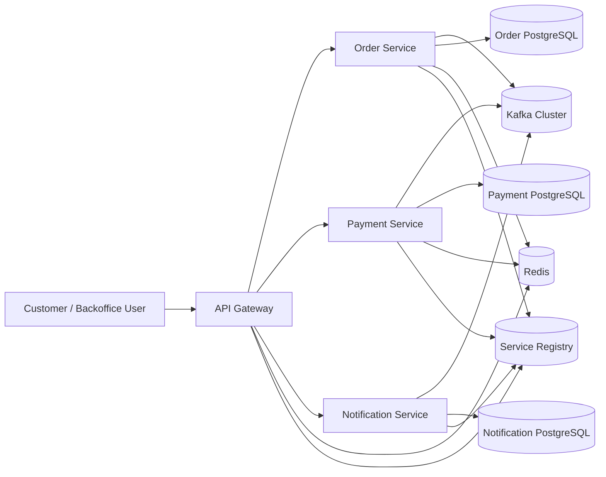
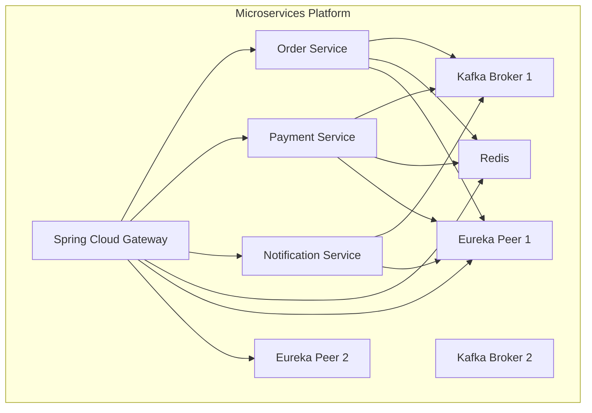
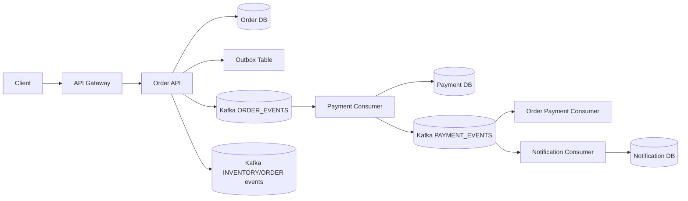
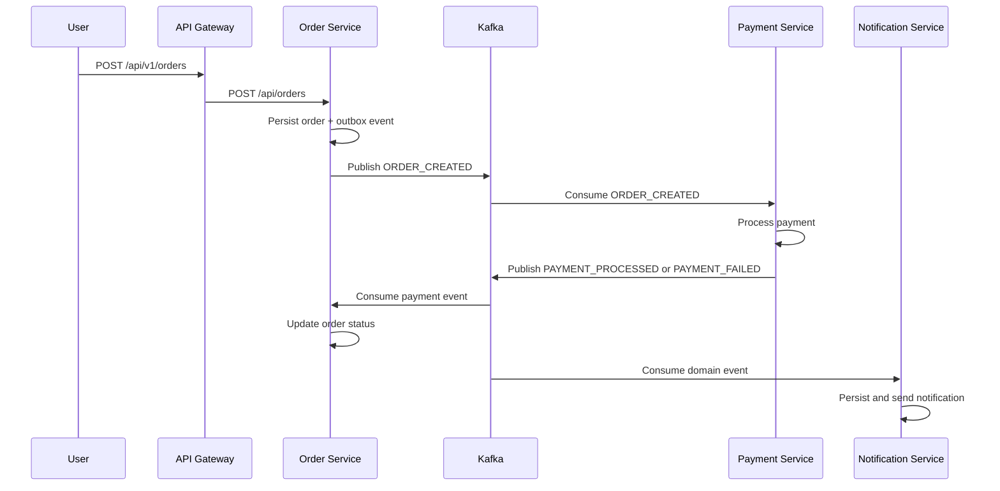
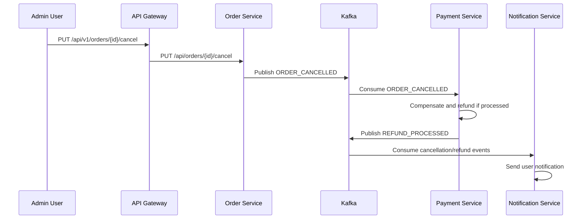

# Phase 8.1 API and Architecture Documentation

## API Documentation

### OpenAPI and Swagger by service

- Order Service: `http://localhost:8081/swagger-ui.html` and `http://localhost:8081/v3/api-docs`
- Payment Service: `http://localhost:8082/swagger-ui.html` and `http://localhost:8082/v3/api-docs`
- Notification Service: `http://localhost:8083/swagger-ui.html` and `http://localhost:8083/v3/api-docs`

### API versioning strategy

- Versioning style: URI major versioning at gateway (`/api/v1/...`) with compatibility aliases (`/api/...`)
- Current supported major version: `v1`
- Backward compatibility:
  - Existing routes remain available under `/api/...`
  - New clients should use `/api/v1/...`
  - Gateway injects `X-Api-Version: 1` for downstream observability
- Deprecation policy:
  - Mark endpoints as deprecated in OpenAPI before removal
  - Keep one major version overlap window during migrations
- Routing policy:
  - Gateway routes both versioned and compatibility paths to service-native endpoints
  - Service controllers stay stable on internal paths (`/api/orders`, `/api/payments`, `/api/notifications`)

### Postman collection

- Collection file: `docs/phase-8/postman/microservices-platform.postman_collection.json`
- Variables:
  - `gatewayUrl` default `http://localhost:8080`
  - `bearerToken` for OAuth2 JWT
  - `orderId`, `paymentId`, `notificationId`, `userId`

## Architecture Documentation

### C4 context diagram

### C4 container diagram

### Data flow diagram

### Sequence diagram: order creation to payment completion

### Sequence diagram: cancellation compensation flow

